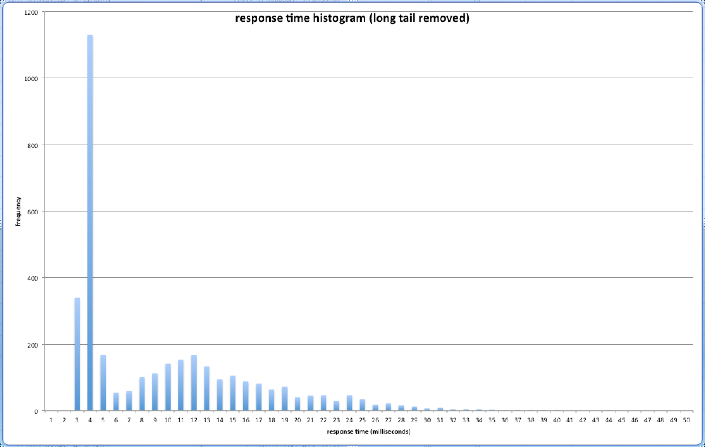
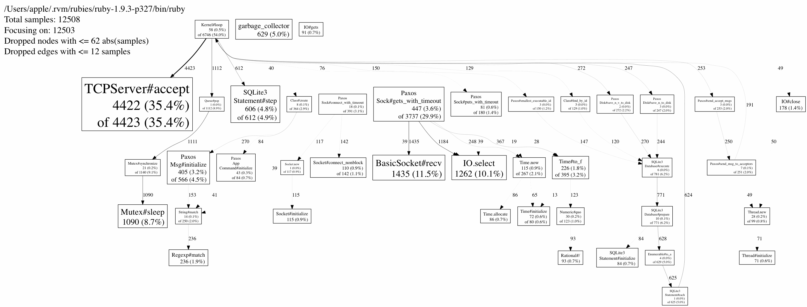
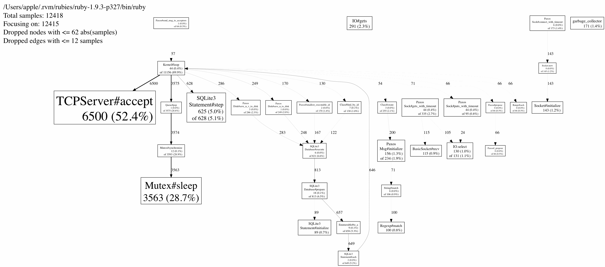

# Paxuby
Paxos algorithm in Ruby

## Introduction
The Paxos algorithm is a cornerstone in building *distributed*, *fault-tolerant*
storage systems. Notable real world applications include [Chubby](http://www.read.seas.harvard.edu/~kohler/class/08w-dsi/chandra07paxos.pdf), Google's lock managing system that serves the Google Filesystem(GFS) and [Gaios](http://static.usenix.org/event/nsdi11/tech/full_papers/Bolosky.pdf), Microsoft's replicated datastore. Regardless of its backend, under the assumption that only *less than half* of a system's instances may encouter failures, Paxos guarantees that:
* service continues to be available without performance compromises
* data remains consistent at every single moment (compare [Eventual consistency](http://en.wikipedia.org/wiki/Eventual_consistency))

Besides the above guarantess, this particular implementation aims at providing:
* a convenient interface to add Paxos support for arbitrary backends, possibly a SQL database or Redis etc. (a feature that is theoretically given but less seen in actually implementations)
* easier maintenance and perhaps higher educational value by being written in a high level language Ruby, while sustaining as much performance as possible (please see the performance section below)

## Usage
Assuming you are using the default key-value backend,
* Set up 'config.yaml' to list the IPs of your cluster, for example
  ```
  addrs:
    - 127.0.0.1:6660
    - 127.0.0.1:6661
    - 127.0.0.1:6662
  ```

* Run `ruby main.rb` in each machine
* Interract with Paxos using the built-in client:
  ```
  irb> require './app/client'
  irb> client = App::Client.new '127.0.0.1:6660'
  irb> client.get 'some_key'
    => 'nil'
  irb> client.set 'some_key', 'the_value'
  irb> client.get 'some_key'
    => 'the_value'
  ```

* Enjoy the fault-tolerance provided by Paxos

## Interface between paxuby and backends
The main interface lies in the `App` module. Custom backends can be supported by implementing:
* the class `App::Command` which assigns the instance variable `@err_msg`
  when there's an error parsing a command string
* the module_function `App.execute`, which is expected to return a `Paxos::App::Result` object.

A straight forward example can be found in './app/app.rb'.

## Testing and Profiling
* Run `bacon test/test.rb` to run all tests. The logs of the test can be displayed by `ps aux | grep ruby; cat tmp/*log; echo 'select * from paxos;' | sqlite3 '127.0.0.1:6660paxos.db'`
* Run `ruby test/perf.rb` to test performance under normal situations where the leader does not change, but with replicas free to fail. The result printed out is the response time of a client request vesus its frequency. In addition, by default we also use [perftools.rb](https://github.com/tmm1/perftools.rb) to profile our code.
* Run `ruby test/leader_promotion_perf.rb` to test performance for the time spent when a leader is dead, and the system automatically elects a new leader.

## Performance
The results of `ruby test/perf.rb` for the response time is 7.5ms for the 50th percentil, 24ms for the 90th, but 600ms for the 99th.
The below charts show the distribution (note that we omited the long tail which is actually important in real world applications) and the results of gperftools for the leader and replicas (wallclock time):




## Config options
We read the configs from 'config.yaml' in YAML format:
```
addrs:
  - 127.0.0.1:6660
  - 127.0.0.1:6661
  - 127.0.0.1:6662
heartbeat_timeout: 0.75 # time for replicas to check whether leader is alive, in seconds
perftools: false # enable gperftools profiling
```

## License
Copyright 2013 Awaw Fumin awawfumin@gmail.com  
Licensed under GNU Affero General Public License v3

## Todos
* implement snapshots
* improve performance according to gperftools results
